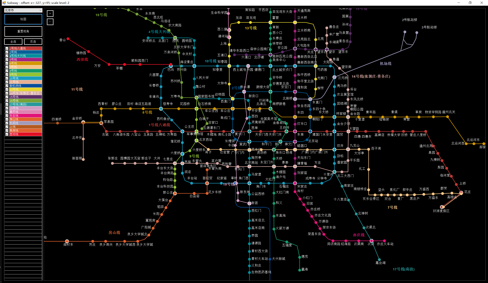

## 百度地图的线路数据

```
https://map.baidu.com/?qt=subways&c=131
```

## 字段含义(猜测)

### sw 段

> \<sw cid="北京市" n="16" c="北京" src="" bg="" icon="icon_beijing" version="64aa703e5b219d223c3a87a7881e3a974410ec34d9e6c1a68100ca0ce033fb17">


| attr | value | 说明 |
| ------- | ------ | ------- |
|     cid    |    北京市     |城市名|
|n|16|不是线路数，？|
|c|北京|城市简称?|
|src|||
|bg||背景图？|
|icon|icon_beijing|??|
|version|64aa703e5b219d223c3a87a7881e3a974410ec34d9e6c1a68100ca0ce033fb17|??|


### l段：线路属性
>  \<l lid="地铁2号线" lb="2号线" slb="2" n="18" loop="true" lbx="-175.3" lby="-4.9" lbr="0.0" lc="0x005f98" uid="9dc3b3dab4becfaea2a934b7" uid2="32c31282e310f2aacb213db7">


| attr | value | 说明 |
| ------- | ------ | ------- |
|lid|地铁2号线|线路全名|
|lb|2号线|简化名|
|slb|2| 更简化的编号，不统一，废弃|
|n|18|?|
|loop|true|是否是环线|
|lbx|-175.3|线路名位置|
|lby|-4.9|线路名位置|
|lbr|0.0|？|
|lc|0x005f98|无重复，线路颜色|
|uid|9dc3b3dab4becfaea2a934b7|无重复，不统一，废弃|
|uid2|32c31282e310f2aacb213db7|无重复，不统一，废弃|

### p段
> \<p sid="人民大学" lb="人民大学" x="-319.6" y="-34.0" rx="3" ry="-9.0" st="true" ex="false" iu="true" rc="false" slb="true" ln="北京市|地铁4号线大兴线" int="2" px="12949724.67" py="4834278.42" uid="ae80941a3f2fe5a796ec8428"/>

| attr | value | 说明 |
| ------- | ------ | ------- |
| sid | 人民大学 | 站名 |
| lb | 人民大学 | 站名too |
| x | -319.6 | 站坐标 |
| y | -34.0 | 站坐标 |
| rx | 3 | 站名偏移 |
| ry | -9.0 | 站名偏移 |
| st | true | 是否是站 |
| ex | false | 是否换乘站 |
| iu | true | ？ |
| rc | false | ？ |
| slb | true | ？ |
| ln | 北京市\|地铁4号线大兴线 | 哪些站经过，换乘站 |
| int | 2 | ？ |
| px | 12949724.67 | 真实经度 |
| py | 4834278.42 | 真实维度 |
| uid | ae80941a3f2fe5a796ec8428 | 站id，会重复 |


### 示意图




